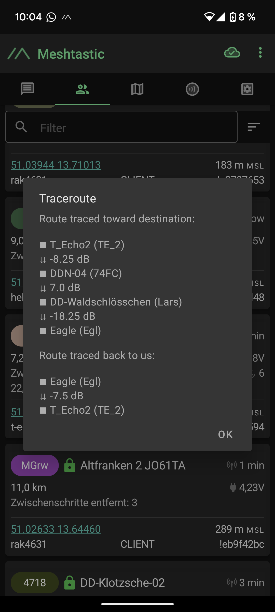
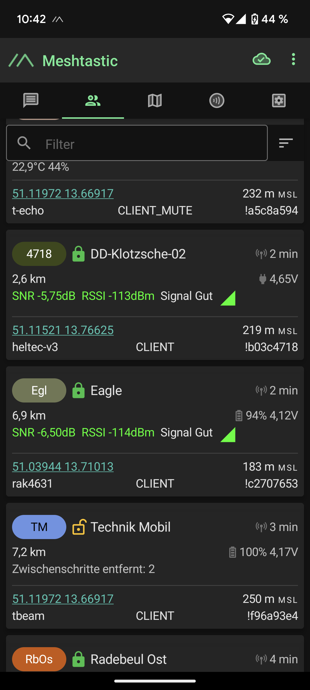
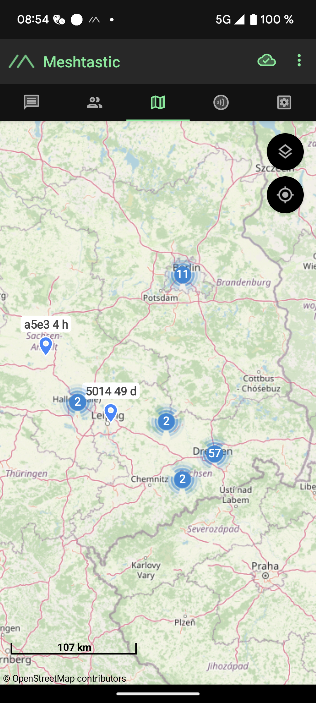

# Ursprüngliche Aufgabe (Netzaufbau)
Die ursprüngliche Aufgabe bestand darin, den Aufbau eines Meshtastic-Netzwerks zu untersuchen, um dieses anschließend mit autarken Notes aufzubauen und zu testen. Nach einer kurzen Startphase wurde jedoch deutlich, dass es in Dresden bereits ein aktives Meshtastic-Netzwerk gibt, das von der Community betrieben wird. Durch den Versand verschiedener Nachrichten wurde die Netzwerkqualität als gut erachtet. Anschließend wurden mithilfe der Traceroute-Funktion verschiedene Tests durchgeführt. 

> ℹ️ **Info:**
  Bei der Traceroute-Funktion wird eine Nachricht an den Empfänger gesendet und dabei gespeichert, über welche Zwischen-Geräte (Hops) die Nachricht gesendet wurde. Nach Empfang der Nachricht sendet der Empfänger die Ergebnisse vom Hinweg sowie eine weitere Traceroute-Nachricht an den ursprünglichen Sender.
  Dieser erhält eine Auflistung aller Knoten, die die Nachricht zum Empfänger gesendet haben, sowie eine Übersicht, wie die Antwort zum Sender kam.
  Auf diese Weise kann der Nachrichtenweg verfolgt werden.
  
  Im Folgenden werden wichtige Erkenntnisse und Ereignisse vorgestellt.  
## Interessante Übertragungswege
### Traceroute mit mehreren Hops
Zu Beginn des Projekts erfolgten Tests zur Reichweitenevaluation. Dabei wurden kurze Nachrichten und Traceroute-Anfragen an verschiedene Teilnehmer des Meshtatic-Netzes geschickt.
Eine dieser Traceroute-Anfragen an den Nutzer Eagle (Egl) brachte folgende Antwort:

Das Besondere an dieser Traceroute-Anfrage ist, dass mein Gerät mit dem Empfängergerät direkt verbunden ist, ohne Zwischenstationen (erkennbar in der Geräteübersicht). Trotz der direkten Verbindung, die zu diesem Zeitpunkt auch aktiv war, wurde die Nachricht über zwei Hops an den Empfänger gesendet. Erst auf dem Rückweg wurde die Nachricht direkt an mich übermittelt.

Annahme: Der Übertragungsweg von meinem Gerät zum Empfänger war nicht ideal, weshalb die Geräte anderer User benötigt wurden, um die Nachricht zu übertragen.

Auswertung: Laut Geräteübersicht war die Verbindung mit Eagle zum Zeitpunkt der Tracerout-Anfrage sehr gut, da die Verbindung ohne Zwischenhops erfolgte und die SNR mit -6,5 dB akzeptabel war.
Mit der Tracerout-Anfrage wird auch ersichtlich, dass der direkte Weg mit insgesamt weniger Verlust möglich ist als der tatsächlich genommene Weg mit insgesamt 33 dB Verlust.

## Große räumliche Ausbreitung
Während des durchgängigen Betriebs des Geräts wurden am Anfang sehr viele neue Empfangsgeräte registriert und in der Geräteübersicht hinzugefügt. So auch Geräte im Raum Berlin und Leipzig.

Hinweis: Das Bild wurde zu einem späten Zeitpunkt aufgenommen, weshalb die Zeit bei dem Gerät in Leipzig schon sehr hoch ist.

Raum Leipzig:
Mit diesen Geräten wurden regelmäßig Bestätigungsnachrichten ausgetauscht, wodurch sich die Verbindungszeiten in der Geräteübersicht aktualisiert haben. Zu verschiedenen Zeitpunkten wurden Traceroute-Anfragen an die Geräte gesendet, die jedoch nie bestätigt wurden. Aufgrund der Geräte, die sich positionstechnisch zwischen Leipzig und Dresden befinden, ist ein Nachrichtentransport grundsätzlich möglich. Die Traceroute-Anfrage wurde wahrscheinlich aufgrund der verschiedenen sendebereiten Zeiten der involvierten Geräte nicht bestätigt.
Eine Verbindung mit Leipzig kann aber auf Grundlage der Geräte als möglich erachtet werden.

Raum Berlin:
Im Raum Berlin werden ebenfalls verschiedene Geräte angezeigt. Bei diesen Geräten ist die räumliche Entfernung mit ca. 200 km sehr groß, ohne dass dazwischen Geräte liegen, die die Nachrichten weiterleiten können. Mit diesen Geräten konnte nur ein einziges Mal eine Verbindung aufgebaut werden; danach waren die Geräte nicht mehr erreichbar. 
Ein Gerät aus Berlin ermöglichte eine mehrmalige Verbindung. Dabei wurden auch die Koordinaten des Geräts gesendet. Dabei war anhand des Positionsverlaufs erkennbar, dass es sich nach den Koordinaten in Berlin befand. Diese Position wurde jedoch ohne Satellitenbestimmung ermittelt. Kurze Zeit später befand sich das Gerät wieder in Dresden, wo die Position mit 12 Satelliten bestätigt wurde. Dies lässt vermuten, dass aufgrund der nicht vorhandenen Satelliten eine falsche Position gesendet wurde und sich das Gerät eventuell gar nicht in Berlin befand.

# neue Aufgabenstellung (Simulatoren)
Nachdem ersichtlich wurde, dass es in Dresden bereits ein funktionsfähiges Netzwerk gibt, das Nachrichten übertragen kann, wurde der Fokus des Projekts auf das Meshtastic-Protokoll an sich verlagert. In diesem Zusammenhang wurde der Meshtasticator (Simulatoren) genauer untersucht.

> ℹ️ **Info:**
    >  Im Meshtastic-Projekt wurden zwei Simulatoren entwickelt: der „Diskrete-Event-Simulator” und der „Interaktive-Event-Simulator”. Mithilfe der Simulatoren können Protokolleigenschaften untersucht und getestet werden.
## Diskrete Event Simulator
Der „Diskrete Event Simulator” wurde entwickelt, um die Leistung des Meshtastic-Netzwerkprotokolls unter verschiedenen Bedingungen zu erproben. Er konzentriert sich dabei auf das Modellieren der Ereignisse im Netzwerk, wie das Senden und Empfangen von Nachrichten. Dabei werden die einzelnen Knoten zu Beginn vom Nutzer platziert und mit Eigenschaften wie Höhe, Daten und Antennengewinn in dBi definiert. Anschließend werden über das erzeugte Netz Nachrichten versendet und die Auslastung des Netzes und der Nodes gemessen.
Während des Simulationsprozesses können auch einige Parameter angepasst werden. So können die verschiedenen Modem-Arten eingestellt und die Zeit zwischen der Nachrichtengenerierung angepasst werden.

> ℹ️ **Info:**
> Mithilfe des Simulators kann beispielsweise untersucht werden, wie das Netz auf eine steigende Anzahl an Knoten reagiert oder wie ein räumlich weit ausgebreitetes Netz arbeitet.

Das Starten des Simulators ist sehr einfach. Dazu müssen lediglich das Python-Skript und die requirements.txt von der GitHub-Seite heruntergeladen und anschließend ausgeführt werden. Dabei kann mittels eines Parameters angegeben werden, ob die Nodes automatisch platziert werden oder durch den Benutzer.
Am Ende der Simulation werden die simulierten Auslastungswerte angezeigt und auch für jede Node einzeln gespeichert, sodass diese nachträglich noch verwendet werden können.
<https://meshtastic.org/docs/software/meshtasticator/discrete-event-sim/>

## Interactive Event Simulator
Der Interactive Event Simulator basiert auf dem Ansatz, dass die komplette Meshtastic-Firmenware in einer Linux-Umgebung simuliert wird. Um das Ausführen des Simulators auch auf Windows- und Mac-Geräten zu ermöglichen, wird diese Linux-Umgebung in einen Docker-Container verpackt. Dieser ermöglicht das Ausführen des Simulators in einer Docker-Umgebung, die viele Gerätetypen unterstützt.
Im Simulator wird für jede simulierte Node ein LoRa-Chip simuliert, um das reale Verhalten der Geräte bestmöglich zu simulieren. Nach dem Versenden der Nachricht wird mithilfe des Pfadverlustmodells berechnet, wie viel Sendeleistung bei der Übertragung zu allen Nodes benötigt wird und welche Nodes die Nachricht noch empfangen. Beim Empfänger wird die Nachricht anschließend verarbeitet und protokolliert. 

> ℹ️ **Info:**
> Da für jede Node die komplette Firmware simuliert wird, eignet sich der Simulator sehr gut, um die Firmware weiterzuentwickeln und Prozesse zu verbessern.

Da sich die einzelnen Positionen der Nodes interaktiv verändern lassen, können auch sehr spezielle Szenarien getestet werden. Dadurch verringert sich der Testaufwand erheblich, da die Tests in der realen Welt auf ein Minimum reduziert werden können.

Die Ausführung des Simulators ist etwas komplizierter, da zunächst Docker installiert werden muss. Docker ist eine Virtualisierungsplattform, die die Linux-Umgebung für die Simulation der Nodes bereitstellt.
Anschließend müssen das Python-Skript und die Anforderungen heruntergeladen und ausgeführt werden.
Bei der Installation der Requirements kommt es oft zu Fehlern, da sich manche Bibliotheken nicht installieren lassen. In den Requirements sind verschiedene Bibliotheken aufgeführt, die bei den dort spezifisch angegebenen Versionen nicht mit anderen Bibliotheken kompatibel sind. Diese Versionen müssen von Hand angepasst und anschließend installiert werden.

Um diesen Prozess zu vereinfachen, wurde versucht, den gesamten Ablauf in einen Docker-Container zu packen, da diese Technologie bereits verwendet wird. Nach der Integration der Komponenten in einen Docker-Container ist es allerdings nicht möglich, die jeweiligen Nodes manuell in der Karte zu platzieren. Das dazu benötigte Fenster kann nämlich nicht aus der Docker-Umgebung nach Windows exportiert werden, um es anzuzeigen. Dadurch kann der Simulator nicht verwendet werden, weshalb die Idee am Ende verworfen wurde.

# Umfrage
Am Ende des Projekts wurde noch eine Umfrage zum Nutzerverhalten von Meshtastic gestartet. Dafür wurde ein Fragenkatalog erarbeitet und mithilfe einer Forms-Umfrage verteilt.
Der Link zur Umfrage wurde damals über LongFast geteilt und von sechs Personen ausgefüllt. Dies macht sie leider nicht repräsentativ. Es wurde sich für die Abfrage per Meshtastic entschieden, um die Community direkt zu erreichen. Im Nachhinein würde ich das anders machen und eventuell häufiger Nachrichten senden oder auch Online-Foren nutzen.

Die Fragen stehen in einer separaten Datei zur Verfügung, wobei nicht alle genutzt wurden.
Der Link zur Umfrage lautet:
<https://forms.cloud.microsoft/Pages/ResponsePage.aspx?id=DQSIkWdsW0yxEjajBLZtrQAAAAAAAAAAAAO__TFoOH5UOEwzWjkzNjdMM1RRT0RDQUdVRldPWVFJQy4u>

In der Excel-Tabelle befinden sich die einzelnen Ergebnisse zur nachträglichen Datenauswertung.  