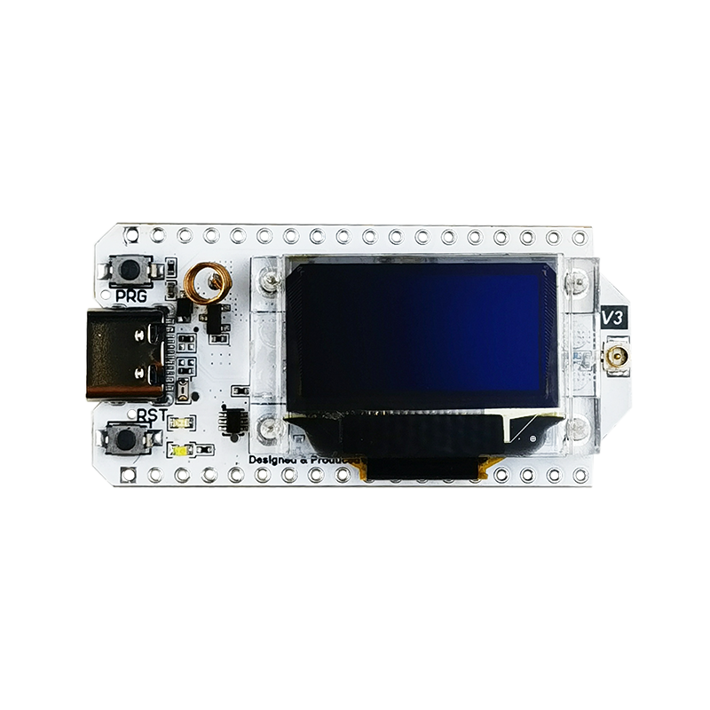
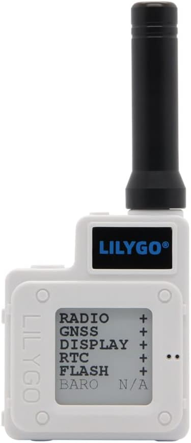
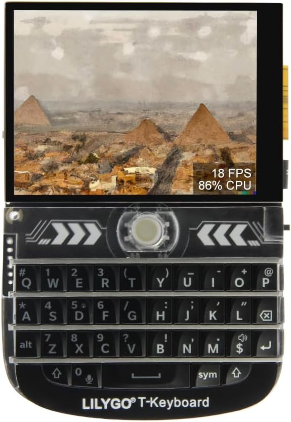

Folgende Geräte haben wir für das Projekt genutzt:

## Heltec LoRa32 v3
> https://heltec.org/project/wifi-lora-32-v3

- max TX power: +22dBm

## LILYGO T-Echo
> https://www.lilygo.cc/products/t-echo

- max TX power: +22dBm

## LILYGO T-Deck
> https://www.lilygo.cc/products/t-deck

- max TX power: +22dBm

