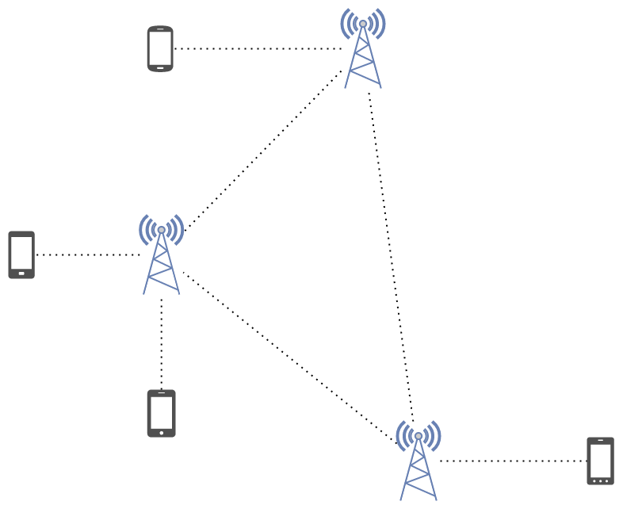

## Was ist LoRa?

LoRa (von Long Range) ist eine proprietäre Funktechnologie im Besitz von Semtech. Sie ist für die Langstreckenübertragung (z.B. 10 km), schmalbandige Übertragung (gemessen in Kbps) und energiesparende Kommunikation konzipiert, hauptsächlich für Internet of Things (IoT)-Netzwerke. Dafür wird eine drahtlose Modulationstechnik, die aus der Chirp Spread Spectrum (CSS)-Technologie abgeleitet ist verwendet. Sie codiert Informationen auf Radiowellen mithilfe von Chirp-Impulsen!
Die modulierte Übertragung von LoRa ist robust gegen Störungen und kann über große Entfernungen empfangen werden.

Es eignet sich ideal für Anwendungen, die kleine Datenmengen mit niedrigen Bitraten übertragen. Daten können über eine längere Reichweite übertragen werden im Vergleich zu Technologien wie Wlan, Bluetooth oder ZigBee. Diese Eigenschaften machen LoRa besonders geeignet für Sensoren und Aktoren, die im Niedrigenergiemodus arbeiten.

Außerdem arbeitet LoRa in einem lizenzfreien Sub-Gigahertz-Frequenzband (d.h. unter 1 GHz), aber die zu verwendenden Frequenzen variieren von Region zu Region aufgrund regulatorischer Anforderungen. Wenn Sie ein LoRa-Gerät kaufen, muss sichergestellt sein, dass das richtige Frequenzband unterstützt wird.

In Europa - 863–870MHz (normalerweise 868MHz).

## Warum LoRa?

LoRa versucht die Lücke zwischen zwischen Kommunikationstechnologien wie WiFi, Bluetooth und LTE zu schließen.

https://www.semtech.com/uploads/images/LoRa_Why_Range.png
Semtech

Es ist für große Reichweite, kleine Bandbreite und Niedrigenergiekommunikation gemacht. Alles in allem also extrem nützlich für IoT Geräte.
Einige Beispiele sind:

- Wassersensoren in einer entfernten Umgebung (Grundwasser)
- Rauchwarnmelder
- Tierbeobachtung
- Verbrauchsmessungen bei Endkunden (Gas, Strom)
- Wetterstationen die nur ab und zu Informationen übertragen

## LoRa and LoRaWAN

LoRaWAN ist über LoRa angesiedelt und definiert das Kommunikationsprotokoll und die Systemarchitektur.

Es ist wichtig zu verstehen, dass es möglich ist LoRa ohne LoRaWAN zu benutzen.
Andere LoRa basierte Netzwerke sind Helium, The Things Network Disaster.radio und, was wir weiter betrachten werden, Meshtastic.

## Meshtastic

Wie im vorherigen Absatz erwähnt, baut Meshtastic auf LoRa auf und schafft ein dezentralisiertes Mesh-Netzwerk.

Es bringt folgende Eigenschaften mit sich:

- Verschlüsselte und Textbasierte Kommunikation
- Plattformunabhängig
  - Computer (unabhänging vom Betriebssystem)
  - Android (dedizierte Chat-App)
  - iOS (dedizierte Chat-App)
- Dezentralisiert
- Geringer Stromverbrauch
- Optionales Standort teilen
- Open-source

Anders als traditionelle Mobilfunknetzwerke, verbindet sich jedes Endnutzergerät mit einem LoRa Radio und alle LoRa Radios, welche Meshtastic nutzen, können Nachrichten, selbst wenn die Radios nicht im gleichen Mesh sind, weiterleiten.
Das passiert so lange, bis die Nachricht Ihr Ziel erreicht oder die voreingestellten "Hops" ausgeschöpft werden.

https://loganmarchione.com/2023/05/lora-and-meshtastic/20230510_003.png
