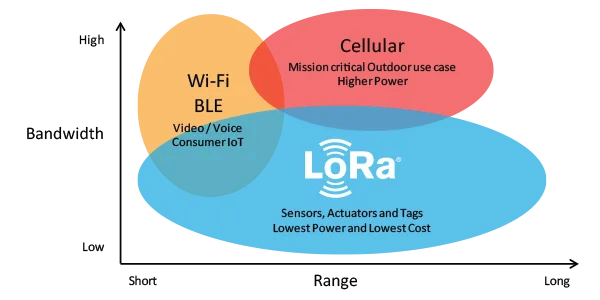
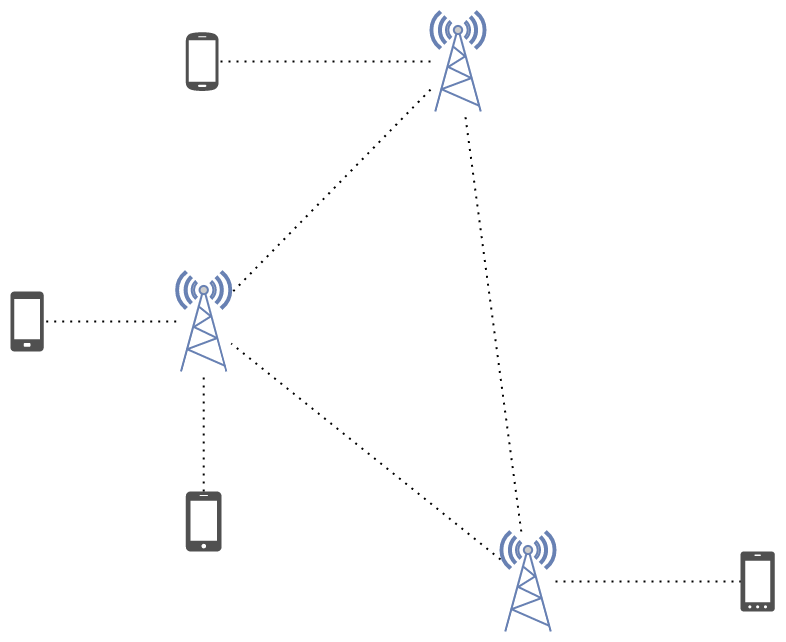

LoRa (von Long Range) ist eine proprietäre Radiotechnologie im Besitz von Semtech. Sie ist für die Langstreckenübertragung (z.B. 10 km), schmalbandige Übertragung (gemessen in Kbps) und energiesparende Kommunikation konzipiert, hauptsächlich für Internet of Things (IoT)-Netzwerke. Dafür wird eine drahtlose Modulationstechnik, die aus der Chirp Spread Spectrum (CSS)-Technologie abgeleitet ist verwendet. Sie codiert Informationen auf Radiowellen mithilfe von Chirp-Impulsen!
? Die modulierte Übertragung von LoRa ist robust gegen Störungen und kann über große Entfernungen empfangen werden.

LoRa eignet sich ideal für Anwendungen, die kleine Datenmengen mit niedrigen Bitraten übertragen. Daten können über eine längere Reichweite übertragen werden im Vergleich zu Technologien wie Wlan, Bluetooth oder ZigBee. Diese Eigenschaften machen LoRa besonders geeignet für Sensoren und Aktoren, die im Niedrigenergiemodus arbeiten.

LoRa arbeitet in einem lizenzfreien Sub-Gigahertz-Frequenzband (d.h. unter 1 GHz), aber die zu verwendenden Frequenzen variieren von Region zu Region aufgrund regulatorischer Anforderungen. Wenn Sie ein LoRa-Gerät kaufen, stellen Sie sicher, dass Sie eines wählen, das auf das richtige Frequenzband für Ihre Region abgestimmt ist.

China - 470-510MHz und 779-787MHz
Europa - 863–870MHz (normalerweise 868MHz)
Indien - 865–867 MHz (normalerweise 865MHz)
Japan - 920-923MHz
USA - 902–928 MHz (normalerweise 915MHz)
Südamerika - 915–928 MHz (normalerweise 915 oder 923MHz)

## Why LoRa?

LoRa tries to bridge the gap between current communication technologies, like WiFi, Bluetooth, and cellular (4G/5G).

https://www.semtech.com/uploads/images/LoRa_Why_Range.png  
Semtech  

LoRa is useful for long-range, low-bandwidth, low-power communication, which is perfect for IoT devices. Some examples include:

a water sensor in a well in a remote location
a factory with hundreds of smoke alarms that all need to communicate
a large nature preserve trying to track animal migration
a natural gas provider needing to monitor each customer’s meter for usage
a weather station that only occasionally needs to transmit information

## LoRa and LoRaWAN

LoRaWAN builds on top of LoRa to define the communication protocol and system architecture.

It’s important to note that you can use LoRa without using LoRaWAN. Other LoRa-based networks (that are not LoRaWAN) include Helium, The Things Network, Disaster.radio, and Meshtastic.

## Meshtastic

Meshtastic builds on LoRa (not LoraWAN) to produce a decentralized mesh network. Features include:

Text-based, encrypted communication
No phone required (e.g., you can use a computer with the right hardware), but there are iOS and Android applications
Decentralization
Great battery life
Optional GPS location sharing
Open-source software
Unlike the traditional cellular network, each end-user device (e.g., phone, laptop, etc…) connects to a LoRa radio running Meshtastic, and all LoRa radios running Meshtastic can mesh together. Messages are relayed through LoRa radios until they reach their destination.

https://loganmarchione.com/2023/05/lora-and-meshtastic/20230510_003.png

LORA RANGE(1300KM):

https://www.gsm-modem.de/M2M/m2m-faq/lpwan-range-comparision-nb-iot-lorawan-sigfox/
