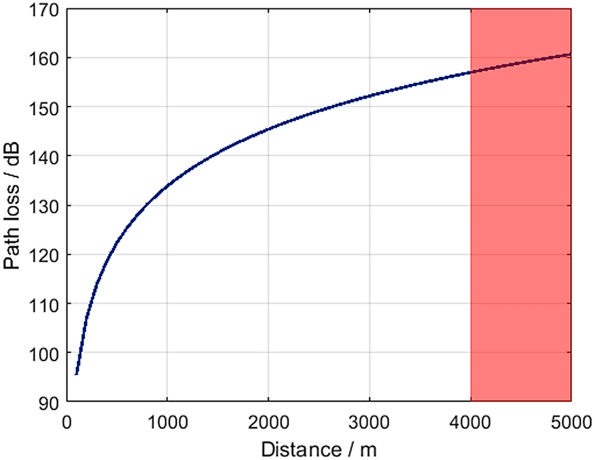

### Link-Budget

Die Reichweite einer Funkverbindung lässt sich mittel des Link-Budgets (Leistungsübertragungsbilanz) darstellen und gibt die Qualität eines Funk-Übertragungskanals an.
Eines der einfachsten Modelle um ein Linkbudget zu errechnen ist mittels Addition der Sendeleistung (Transmitter Power, Tx), der Empfängerempfindlichkeit (Receiver Power, Rx), des Antennengewinns und der Freiraumdämpfung (Free Space Path Loss, FSPL).

### Kenngrößen

Der Spreading Faktor und somit die Reichweite eines Senders sind von den Ausbreitungsbedingungen abhängig.
Die Empfängerempfindlichkeit hängt von Signal-Rausch-Verhältnis (SNR), Rauschfaktor (NF) und Bandbreite (BW) ab.

Die Freiraumdämpfung beeinträchtigt die Reichweite. Durch die Verdopplung der Entfernung nimmt die Freiraumdämpfung um 6 dB zu.
Reflektionen und Brechungen der Funkwellen an Hindernissen und Boden beeinflussen Signalpegel und Reichweite. Im LoRaWAN-Netzwerk befindet sich eine Seite der Funkverbindung in der Regel in Bodennähe.
Hindernisse in der ersten Fresnelzone beeinflussen den Signalpegel auf der Rx-Seite und verkürzen die Reichweite.
SF-Werte und somit die Reichweite eines Senders hängen von den Ausbreitungsbedingungen ab. LoRaWAN erlaubt mittels ADR ein automatisches Netzmanagement und regelt damit die Reichweiten der Sender.

### dB

Die Einheit dB (Dezibel) wird im Zusammenhang mit Funkverbindungen verwendet, um die Signalstärke, Dämpfung oder Verstärkung von elektromagnetischen Signalen zu messen. dB ist eine logarithmische Einheit, die das Verhältnis zwischen zwei Größen ausdrückt. In Bezug auf Funkverbindungen sind die beiden häufigsten Anwendungen die Messung der Signalstärke und die Angabe von Dämpfung oder Verstärkung.

1. **Signalstärke in dBm (Dezibel Milliwatt):**

   - dBm misst die absolute Leistung eines Signals im Vergleich zu einem Referenzwert von 1 Milliwatt.
   - Ein positives dBm-Wert zeigt an, dass das Signal stärker ist als 1 Milliwatt, während ein negativer Wert darauf hinweist, dass es schwächer ist.
   - Beispiel: Ein Signal mit -50 dBm ist stärker als ein Signal mit -60 dBm.

2. **Dämpfung und Verstärkung in dB:**
   - dB wird auch verwendet, um die Dämpfung oder Verstärkung von Signalen in einer Leitung oder einem System auszudrücken.
   - Eine positive dB-Angabe deutet auf Verstärkung hin, während eine negative dB-Angabe auf Dämpfung hinweist.
   - Beispiel: Ein Verstärker, der das Signal um 20 dB verstärkt, erhöht die Signalstärke um das 100-fache.

Bei Funkverbindungen wird die Signalstärke oft in dBm gemessen, während Dämpfung oder Verstärkung von Antennen, Kabeln oder Verstärkern in einfachen dB-Angaben ausgedrückt werden. Dies ermöglicht eine präzise und effektive Kommunikation über die Leistung von Funksignalen und die Leistung von Komponenten in drahtlosen Netzwerken.

### Channelsettings

|                           |                     |
| ------------------------- | ------------------- |
| Channelsetting            | Long Range / Fast   |
| Alt Channelname           | Long Fast           |
| Data Rate                 | 1.07 kbps (default) |
| Spreading Factor/ Symbols | 11 / 2048           |
| Coding Rate               | 4/5                 |
| Bandwith                  | 250                 |

### Transceiverwerte

|                |         |
| -------------- | ------- |
| transmit Power | 17dBm   |
| Antenna gain   | 1,5dBi  |
| RX sensitivity | -136dBm |
| RX antenna     | 0dBi    |
| Link Budget    | 150dB   |

WiFi LoRa 32 v3 (SX1262 Lora Chip)
P(dBm) = 21dBm +-1dBm
Max Receiving sensitivity = -136dBm@SF12 BW=125KHz

### Maximal mögliche Übertragunsstärke

$ \text{Maximal 500mW ERP (1)} $

$$
\begin{align*}
P(dBm) &= 10 ⋅ \log_{10} (P(500 \ \mathrm{mW}) \div 1 \ \mathrm{mW}) \\

&= 26.9897000434 \\

&= 27 \ \mathrm{dBm} \\
\end{align*}
$$

(1) <https://www.bundesnetzagentur.de/DE/Fachthemen/Telekommunikation/Frequenzen/Grundlagen/Frequenzplan/frequenzplan-node.html>
(Stand März 2022) Eintrag 251004 (Frequenznutzungsbedingungen)

## Überlegungen

Mit einem Link Budget von 150dBm (Einstellung = long fast, mit 17dBm transmit Power und 1,5dBi Antenne) lässt sich unter optimalen Bedingungen(nur Freiraumdämpfung(Vakuum)) eine Distanz von bis zu 800km Überwinden

Im Weltraum können Funksignale tatsächlich viel weiter reisen. Unter Normalbedingungen, auf unserem Planeten spielt die Sichtlinie eine bedeutende Rolle.
Aufgrund der Tatsache, dass die Welt eine Kugel ist, ist es möglich auf 1,7m höhe 4,7km weit zu sehen.
Da im sub-GHz Bereich eine quasioptische Ausbreitung für Radiowellen gilt. ist der Horizont auch gleichzeitig eine Begrenzung für Signale.

Im nächsten Schritt betrachten wir die Wellenausbreitung mit dem Hata-Okumura-Modell (Hata-Modell).

Das Hata-Modell verwendet verschiedene Begriffe uin der Dämpfungsformel, um zwischen verschiedenen Landnutzungen zu unterscheiden, von ländlicher bis zu dicht besiedelten Region.

Hata-Ausbreitungsformel

$$
\begin{align*}

d &= \text{Entfernung zwischen Sender und Empfänger} \\
h_s &= \text{Höhe der Senderantenne} \\
h_r &= \text{Empfängerantennenhöhe} \\
K(h_r) &= \text{Korrekturfaktor abhängig } h_r \\
f &= \text{Übertragungsfrequenz} \\

\end{align*}

\\[2em]

\begin{align*}
L_p \text{(urbanes Gebiet)} &= 69.55 + 26.16 \cdot \log_{10}{f} \\&\quad - 13.82 \cdot \log_{10}{h_s} \\&\quad + [44.9 - 6.55 \cdot \log_{10}{h_s}] \\&\quad \cdot \log_{10}{d} - K(h_r) \\

L_p \text{(suburbanes Gebiet)} &= L_p \text{(urbanes Gebiet)} - 2 \cdot [\log_{10}{(f/28)}]^2 - 5.4\\
L_p \text{(offenes Gebiet)} &= L_p \text{(urbanes Gebiet)} - 4.78 \cdot (\log_{10}{f})^2 + 18.33 \cdot \log_{10}{f} - 40.94\\
\end{align*}

$$

**Urbanes Gebiet:** große Stadt mit großen Gebäuden welche zwei oder mehreren Stockwerken oder größere Dörfer mit sehr nahen Häusern.

**Suburbanes Gebiet:** Stadt oder oder Autobahn mit vereinzelten Bäumen und Gebäuden. Einige Hindernisse in der Nähe des Empfängers aber nicht sehr überfüllt.

**Offenes Gebiet:** Keine großen Bäume oder Gebäude in Sichtlinie.

$$
\begin{align*}

\text{Mittlere Stadt - kleine Stadt} K(h_r) &= (1.1 \cdot log_{10}{f} - 0.7) \cdot h_r - (1.56 \cdot \log{10}{f} - 0.8 \\

\text{Großstadt, f <= 300 MHz: }K(h_r) &= 8.29 \cdot (\log_{10}{1.54 \cdot h_r})^2  - 1.1 \\

\text{Großstadt, f > 300 MHz: }K(h_r) &= 3.2 \cdot (\log_{10}{11.75 \cdot h_r})^2 - 4.97

\end{align*}

$$

[[1](https://www.researchgate.net/figure/Okumura-Hata-Model-for-path-loss-for-small-and-medium-sized-cities-The-red-shaded-area_fig3_327211499)]

Die Grafik zeigt die Reichweite nach dem Okumura Hata Modell für Vororte und Kleinstädte. Der Rote Bereich überschreitet das totale link budget welches mit LoRa transceivern erlaubt ist.

Die bereitgestellten Formeln decken nicht alle im Okumuras-Bericht vorgeschlagenen Bedingungen ab. Hatas Ansatz gilt für folgende Einschränkungen:

|                       |              |
| --------------------- | ------------ |
| Frequenz              | 100-1500 MHz |
| Distanz               | 1-20km       |
| Höhe Senderantenne    | 25-200m      |
| Höhe Empfängerantenne | 1-10m        |

Weil Hatas Modell nur für Entfernungen größer als 1km gilt, nutzen Simulatoren Freiraumausbreitung bis zu dieser Entfernung.

Für die folgende Reichweitenanalyse wird eine Dämpfung von 20 dB für das Eindringen in Gebäude und ein Verlust von 8 dB für Fading angenommen. Das bedeutet, dass es an die Bedingungen für Sender innerhalb von Gebäuden angepasst ist. Das Link-Budget wird daher um 28 dB reduziert um die Abdeckung in dicht bebauten Umgebungen zu simulieren.

| LinkBudget             | 154dBm |
| ---------------------- | ------ |
| Range Hata Open        | 35,3km |
| Range Hata City        | 5,2km  |
| Range City(-28dB loss) | 0,85km |
| Line of sight          | 22,7km |

Das Hata-Modell beachtet keine Sichtlinie, deswegen habe ich die Höhe der Antenne des Senders auf 25Meter festgelegt, da die die übliche Antennenhöhe einer LTE-Antenne im innerstädtischem Gebiet darstellt und die Sichtlinie seperat mit 22,7km berechnet.

Hata Open bedeutet, dass sich nichts zwischen der Sender und Empfengerantenne befindet. Die Radiowelle wird nur durch die Freifeld-Dämpfung und die Erdoberfläche abgeschwächt. Daher sind die im obigen Tabella angegebene Reichweite von 35,3km nur theoretische Werte.
Das einfache Hata-Modell unterscheidet nicht zwischen Wasseroberflächen, Wiesen, Ackerland oder offenen Flächen mit geringer Vegetation welche das Signal unterschiedlich beeinflussen würden.

## Fazit

Fazit: Das Hata-Modell kennt keine Erdkrümmung und ist nur eine erste Näherung. Als Kontrolle sollte immer die Sichtlinie beachtet werden. Um genauere Werte zu erreichen kann das Longley-Rice-Modell verwendet werden.

## Notizen

### Link-Budget Formel

$$

\begin{align*}
PRX &= PTX + GTX + GRX − LTX − LFS − LP − LRX \\

\\

PRX &= \text{received power (dBm)} \\
PTX &= \text{transmitter output power (dBm)} \\
GTX &= \text{transmitter antenna gain (dBi)} \\
GRX &= \text{receiver antenna gain (dBi)} \\
LTX &= \text{transmit feeder and associated losses (feeder, connectors, etc.) (dB)} \\
LFS &= \text{free space loss or path loss (dB)} \\
LP  &= \text{miscellaneous signal propagation losses} \\
    &\phantom{=} \text{(these include fading margin, polarization mismatch, losses associated with} \\
   &\phantom{=} \text{medium through which signal is travelling, other losses...) (dB)} \\
LRX &= \text{receiver feeder and associated losses (feeder, connectors, etc.) (d)B} \\

\\[2em]

FSPL \mathrm{(dB)} &= 20\log_{10}(d) + 20\log_{10}(f) - 147.55 \\
FSPL &= (4πd/λ) \cdot 2 = (4πdf/c) \cdot 2 \\
\\
FSPL &= \text{Free Space Path Loss (Freiraumdämpfung)} \\
d &= \text{Abstand zwischen Tx und Rx in Metern} \\
f &= \text{Frequenz in Hertz} \\
\\
\text{Rx-Empf.} &= -174 + 10\log_{10}(BW) + NF + SNR \\
BW &= \text{Bandbreite in Hz} \\
NF &= \text{Rauschfaktor in dB} \\
SNR &= \text{Signal-Rausch-Verhältnis (signal to noise ratio).} \\
    &\phantom{=} \text{Es gibt an, wie weit das Signal über dem Rauschen liegen muss.}

\end{align*}

$$

### Line of Sight tool

<https://www.heywhatsthat.com>

### Beispielrechnung

Let's consider a simplified example of a LoRa link budget for a point-to-point communication link. Please note that real-world scenarios are more complex and involve additional factors, but this example should provide a basic understanding:

1. **Transmit Power (Tx Power):** Let's assume the transmitter has a power output of 20 dBm.

2. **Frequency (f):** Assume a frequency of 868 MHz.

3. **Distance (d):** Let's consider a communication distance of 2 kilometers.

4. **Antenna Gains (Gt and Gr):** Assume both the transmitter and receiver antennas have a gain of 2 dBi.

5. **Free Space Path Loss (Lp):** Using the free space path loss formula:

   $$
   Lp = 20 \log_{10}{d} + 20 \log_{10}{f} + L_{FS}
   $$

   $$
   Lp = 20 \log_{10}{2} + 20 \log_{10}{(868 \cdot 10^6)} + 20 \cdot \log_{10}{\frac{4\pi}{c}}
   $$

   Here, \(c\) is the speed of light. The result will be the path loss in dB.

6. **Received Power (Rx Power):** Plug the values into the link budget equation:

   $$
   \text{Rx Power} = \text{Tx Power} + \text{Tx Antenna Gain} - \text{Path Loss} + \text{Rx Antenna Gain}
   $$

   Substitute the values and calculate the received power.

The calculated received power should be compared with the receiver's sensitivity specification. If the received power is higher than the sensitivity threshold, the link is expected to work under the specified conditions.

Keep in mind that this is a simplified example, and in a real-world scenario, additional factors such as atmospheric conditions, interference, and fading effects should be considered for a more accurate link budget analysis.
