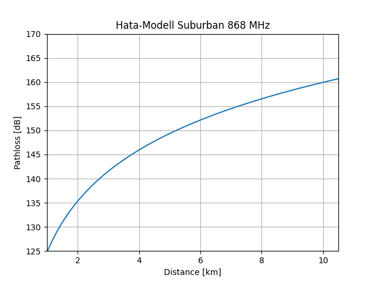

### Link-Budget

Die Reichweite einer Funkverbindung lässt sich mittel des Link-Budgets (Leistungsübertragungsbilanz) darstellen und gibt die Qualität eines Funk-Übertragungskanals an.
Eines der einfachsten Modelle um ein Linkbudget zu errechnen ist mittels Addition der Sendeleistung (Transmitter Power, Tx), der Empfängerempfindlichkeit (Receiver Power, Rx), des Antennengewinns und der Freiraumdämpfung (Free Space Path Loss, FSPL).

### Kenngrößen

Der Spreading Faktor und somit die Reichweite eines Senders sind von den Ausbreitungsbedingungen abhängig.
Die Empfängerempfindlichkeit hängt von Signal-Rausch-Verhältnis (SNR), Rauschfaktor (NF) und Bandbreite (BW) ab.

Die Freiraumdämpfung beeinträchtigt die Reichweite. Durch die Verdopplung der Entfernung nimmt die Freiraumdämpfung um 6 dB zu.
Reflektionen und Brechungen der Funkwellen an Hindernissen und Boden beeinflussen Signalpegel und Reichweite. Im LoRaWAN-Netzwerk befindet sich eine Seite der Funkverbindung in der Regel in Bodennähe.
Hindernisse in der ersten Fresnelzone beeinflussen den Signalpegel auf der Rx-Seite und verkürzen die Reichweite.
SF-Werte und somit die Reichweite eines Senders hängen von den Ausbreitungsbedingungen ab. LoRaWAN erlaubt mittels ADR ein automatisches Netzmanagement und regelt damit die Reichweiten der Sender.

### dB

Die Einheit dB (Dezibel) wird im Zusammenhang mit Funkverbindungen verwendet, um die Signalstärke, Dämpfung oder Verstärkung von elektromagnetischen Signalen zu messen. dB ist eine logarithmische Einheit, die das Verhältnis zwischen zwei Größen ausdrückt. In Bezug auf Funkverbindungen sind die beiden häufigsten Anwendungen die Messung der Signalstärke und die Angabe von Dämpfung oder Verstärkung.

1. **Signalstärke in dBm (Dezibel Milliwatt):**

   - dBm misst die absolute Leistung eines Signals im Vergleich zu einem Referenzwert von 1 Milliwatt.
   - Ein positives dBm-Wert zeigt an, dass das Signal stärker ist als 1 Milliwatt, während ein negativer Wert darauf hinweist, dass es schwächer ist.
   - Beispiel: Ein Signal mit -50 dBm ist stärker als ein Signal mit -60 dBm.

2. **Dämpfung und Verstärkung in dB:**
   - dB wird auch verwendet, um die Dämpfung oder Verstärkung von Signalen in einer Leitung oder einem System auszudrücken.
   - Eine positive dB-Angabe deutet auf Verstärkung hin, während eine negative dB-Angabe auf Dämpfung hinweist.
   - Beispiel: Ein Verstärker, der das Signal um 20 dB verstärkt, erhöht die Signalstärke um das 100-fache.

Bei Funkverbindungen wird die Signalstärke oft in dBm gemessen, während Dämpfung oder Verstärkung von Antennen, Kabeln oder Verstärkern in einfachen dB-Angaben ausgedrückt werden. Dies ermöglicht eine präzise und effektive Kommunikation über die Leistung von Funksignalen und die Leistung von Komponenten in drahtlosen Netzwerken.

### Channelsettings

|                           |                     |
| ------------------------- | ------------------- |
| Channelsetting            | Long Range / Fast   |
| Alt Channelname           | Long Fast           |
| Data Rate                 | 1.07 kbps (default) |
| Spreading Factor/ Symbols | 11 / 2048           |
| Coding Rate               | 4/5                 |
| Bandwith                  | 250                 |

### Transceiverwerte

|                |         |
| -------------- | ------- |
| transmit Power | 21dBm   |
| Antenna gain   | 0dBi  |
| RX sensitivity | -131dBm |
| RX antenna     | 0dBi    |
| Link Budget    | 152dB   |

WiFi LoRa 32 v3 (SX1262 Lora Chip)
P(dBm) = 21dBm
Max Receiving sensitivity = -136dBm@SF12 BW=125KHz

(1)<https://www.semtech.com/design-support/lora-calculator>

### Maximal mögliche Übertragunsstärke

$ \text{Maximal 500mW ERP (2)} $
$ \text{Maximal 2.15dBi Antenne (3)} $

$$
\begin{align*}
P(dBm) &= 10 ⋅ \log_{10} (P(500 \ \mathrm{mW}) \div 1 \ \mathrm{mW}) \\

&= 26.9897000434 \\

&= 27\mathrm{dBm} \\
\\
P(max)&=P(dBm)+2.15\mathrm{dBi}\\
P(max)&=29.15dBm
\end{align*}
$$

(2) <https://www.bundesnetzagentur.de/DE/Fachthemen/Telekommunikation/Frequenzen/Grundlagen/Frequenzplan/frequenzplan-node.html>
(Stand März 2022) Eintrag 251004 (Frequenznutzungsbedingungen)
(3) <https://www.thethingsnetwork.org/forum/t/max-allowed-antenna-gain-for-lora/37182>
## Überlegungen

Mit einem Link Budget von 152dBm (Einstellung = long fast, mit 21dBm transmit Power und 0dBi Antenne) lässt sich unter optimalen Bedingungen(nur Freiraumdämpfung(Vakuum)) eine Distanz von mehr als 800km Überwinden.
Da dies nur unter optimalen Bedingungen möglich ist werden solche Werte natürlich nicht erreicht.

Im Weltraum können Funksignale tatsächlich viel weiter reisen. Unter Normalbedingungen, auf unserem Planeten spielt die Sichtlinie eine bedeutende Rolle.
Aufgrund der Tatsache, dass die Welt eine Kugel ist, ist es möglich mit 1,7m Höhe 4,7km weit zu sehen.
Da im sub-GHz Bereich eine quasioptische Ausbreitung für Radiowellen gilt, ist der Horizont auch gleichzeitig eine Begrenzung für Funksignale.

Im nächsten Schritt betrachten wir die Wellenausbreitung mit dem Hata-Okumura-Modell (Hata-Modell).

Das Hata-Modell verwendet verschiedene Begriffe in der Dämpfungsformel, um zwischen verschiedenen Typen von Landoberflächen zu unterscheiden. Es werden ländliche bis zu dicht besiedelte Regionen unterschieden.

Hata-Ausbreitungsformel:

$$
\begin{align*}
Loss(dB) &= A + B \cdot log_{10}{(d)} - K + C \\

d &= \text{Distanz zwischen Sender und Empfänger (km)} \\
h_s &= \text{Höhe der Senderantenne (m)} \\
h_r &= \text{Empfängerantennenhöhe (m)} \\
K &= \text{Korrekturfaktor} \\
f &= \text{Übertragungsfrequenz  [MHz]} \\

\end{align*}

\\[2em]

\begin{align*}
A &= 69.55 + 26.16 \cdot \log_{10}{(f)} - 13.82 \cdot \og_{10}{(h_s)} \\
B &= 44.9 - 6.55 \og_{10}{(h_s)} \\
\end{align*}

$$

**Urban:** große Stadt mit großen Gebäuden welche zwei oder mehreren Stockwerken besitzen oder größere Dörfer mit sehr nahe stehenden Häusern.

**Medium:**  Mittelgroße Stadt

**Suburban:** Vorort

**freifläche:** Keine großen Bäume oder Gebäude in Sichtlinie.

$$
\begin{align*}

\text{Freifläche:} \\
K &= (1.1 \cdot \log_{10}{(f)} - 0.7) \cdot h_r - (1.56 \cdot \log_{10}{(f)} - 0.8) \\
C &= -4.78 \cdot (\log_{10}{(f)})^2 + 18.33 \cdot \log_{10}{(f)} - 40.94\\

\text{Suburban:} \\
K &= (1.1 \cdot \log_{10}{(f)} - 0.7) \cdot h_r - (1.56 \cdot \log_{10}{(f)} - 0.8) \\
C &= -2 \cdot [\log_{10}{(f/28)}]^2 - 5.4\\

\text{Medium:} \\
K &= (1.1 \cdot \log_{10}{(f)} - 0.7) \cdot h_r - (1.56 \cdot \log_{10}{(f)} - 0.8) \\
C &= 0 \\

\text{Urban, 150 <= f <= 200 MHz:} \\ 
K &= 8.29 \cdot (\log_{10}{(1.54 \cdot h_r)})^2  - 1.1 \\
C &= 0 \\

\text{Urban, 200 < f <= 1500 MHz:} \\
K &= 3.2 \cdot (\log_{10}{(11.75 \cdot h_r)})^2 - 4.97 \\
C &= 0 \\

\end{align*}

$$

Die Grafik zeigt die Reichweite nach dem Okumura-Hata-Modell für ein Suburbanes Gebiet bei Nutzung einer 868MHz frequenz. Wie der Grafik zu entnehmen, wird bei unsererem Linkbudget von 152dBm maximal eine Reichweite von ungefähr 6km möglich

Die bereitgestellten Formeln decken nicht alle im Okumura-Modell vorgeschlagenen Bedingungen ab. Hatas Ansatz gilt nur mit folgende Einschränkungen:

|                       |              |
| --------------------- | ------------ |
| Frequenz              | 150-1500 MHz |
| Distanz               | 1-20km       |
| Höhe Senderantenne    | 30-200m      |
| Höhe Empfängerantenne | 1-10m        |

$$
\text{Mit folgenden Werten wurde im suburbanen gearbeitet: }\\

\begin{align*}
h_s &= 30\mathrm{m} \\
h_r &= 2\mathrm{m} \\
f &= 869\mathrm{MHz} \\
\end{align*}
$$
Somit können die gleichbleibenden Variablen A und B im Vorfeld bestimmt werden  
$$
\begin{align*}
A &= 69.55 + 26.16 \cdot \log_{10}{(f)} - 13.82 \cdot \log_{10}{(h_s)} \\
&= 69.55 + 26.16 \cdot \log_{10}{(868)} - 13.82 \cdot \log_{10}{(30)} \\
&\thickapprox 126.008 \\
\\
B &= 44.9 - 6.55 \log_{10}{(h_s)} \\
&= 44.9 - 6.55 \log_{10}{(30)}\\
&\thickapprox 35.225\\
\\
K &= (1.1 \cdot log_{10}{(f)} - 0.7) \cdot h_r - (1.56 \cdot \log_{10}{(f)} - 0.8) \\
&= (1.1 \cdot log_{10}{(868)} - 0.7) \cdot 2 - (1.56 \cdot \log_{10}{(868)} - 0.8) \\
&\thickapprox 1.281 \\
\\
C &= 0 \\
\\
\text{Somit müssen wir die einfache Formel nur noch nach d umstellen}\\
\\
Loss(dB) &= A + B \cdot log_{10}{(d)} - K + C \\
log_{10}{(d)} &= \frac{Loss(dB) - A + K - C}{B} \\
d &= 10^\frac{Loss(dB) - A + K - C}{B} \\
&= 10^\frac{Loss(dB) - 126.008 + 1.281 - 0}{35.225}\\
&= 10^\frac{Loss(dB) - 124.727}{35.225}\\
\end{align*}

% K Urban = 1.045
% C Urban = 0
% K Freifläche = Suburban = 1.281
% C Suburban = 0
% C Freifläche = -28.352
$$
|             |  |
| ---------------------- | ------ |
| Freifläche(Max)        | 64.640km (begrenzt auf Sichtlinie 24.6km) |
| Suburban(Max)          | 10.130km|
| Urban(Max)             | 9.975km |
|||
| Freifläche(152dB)      | 37.943km (begrenzt auf Sichtlinie 24.6km) |
| Suburban(152dB)        | 5.946km |
| Urban(152dB)           | 5.855km |
|||
| Freifläche(Gebäude)    | 12.612km |
| Suburban(Gebäude)      | 1.220km |
| Urban(Gebäude)         | 1.018km |
|||
|Sichtlinie              | 24.6km  |

Für (Gebäude) wird eine Dämpfung von 17dB für das Eindringen in Gebäude und ein Verlust von 8dB für das Fading angenommen. Das bedeutet, dass die Analyse an die Bedingungen für Sender innerhalb von Gebäuden angepasst wurde. Das Link-Budget wird daher um 25 dB auf 128dB reduziert.

Für (Max) wird das maximal mögliche legale Limit für Sendeleistung und Antennenverstärkung ausgereizt und liegt bei einem Linkbudget, wie anfänglich dargelegt, von 160.15dB.

(152dB) beschreibt die maximal mögliche ausbreitung des Signals bei der Sendeleistung der von uns verwendeten Geräte.

Die Höhe der Antenne des Senders wurde auf 30Meter festgelegt, da dass Hata Modell nur mit dieser minimalen Höhe arbeiten kann.  
Die Empfängerantenne liegt auf 2Meter Höhe.

## Fazit

Fazit: Das Hata-Modell kennt keine Erdkrümmung und ist nur eine erste Näherung. Als Kontrolle sollten bei Berechnungen immer die Sichtlinie beachtet werden und damit die plausabilität der Berechnung kontolliert und ggf. eingeschränkt werden. Die minimale Höhe der Senderantenne macht die Anwendung des Hata-Modells für unser Projekt weniger praktikabel gibt jedoch einen ersten Anhaltspunkt um mit unseren Messwerten zu vergleichen.

## Notizen

### Link-Budget Formel

$$

\begin{align*}
PRX &= PTX + GTX + GRX − LTX − LFS − LP − LRX \\

\\

PRX &= \text{received power (dBm)} \\
PTX &= \text{transmitter output power (dBm)} \\
GTX &= \text{transmitter antenna gain (dBi)} \\
GRX &= \text{receiver antenna gain (dBi)} \\
LTX &= \text{transmit feeder and associated losses (feeder, connectors, etc.) (dB)} \\
LFS &= \text{free space loss or path loss (dB)} \\
LP  &= \text{miscellaneous signal propagation losses} \\
    &\phantom{=} \text{(these include fading margin, polarization mismatch, losses associated with} \\
   &\phantom{=} \text{medium through which signal is travelling, other losses...) (dB)} \\
LRX &= \text{receiver feeder and associated losses (feeder, connectors, etc.) (d)B} \\

\\[2em]

FSPL \mathrm{(dB)} &= 20\log_{10}(d) + 20\log_{10}(f) - 147.55 \\
FSPL &= (4πd/λ) \cdot 2 = (4πdf/c) \cdot 2 \\
\\
FSPL &= \text{Free Space Path Loss (Freiraumdämpfung)} \\
d &= \text{Abstand zwischen Tx und Rx in Metern} \\
f &= \text{Frequenz in Hertz} \\
\\
\text{Rx-Empf.} &= -174 + 10\log_{10}(BW) + NF + SNR \\
BW &= \text{Bandbreite in Hz} \\
NF &= \text{Rauschfaktor in dB} \\
SNR &= \text{Signal-Rausch-Verhältnis (signal to noise ratio).} \\
    &\phantom{=} \text{Es gibt an, wie weit das Signal über dem Rauschen liegen muss.}

\end{align*}

$$

### Line of Sight tool

<https://www.heywhatsthat.com>

### Beispielrechnung

Let's consider a simplified example of a LoRa link budget for a point-to-point communication link. Please note that real-world scenarios are more complex and involve additional factors, but this example should provide a basic understanding:

1. **Transmit Power (Tx Power):** Let's assume the transmitter has a power output of 20 dBm.

2. **Frequency (f):** Assume a frequency of 868 MHz.

3. **Distance (d):** Let's consider a communication distance of 2 kilometers.

4. **Antenna Gains (Gt and Gr):** Assume both the transmitter and receiver antennas have a gain of 2 dBi.

5. **Free Space Path Loss (Lp):** Using the free space path loss formula:

   $$
   Lp = 20 \log_{10}{d} + 20 \log_{10}{(f)} + L_{FS}
   $$

   $$
   Lp = 20 \log_{10}{2} + 20 \log_{10}{(868 \cdot 10^6)} + 20 \cdot \log_{10}{\frac{4\pi}{c}}
   $$

   Here, \(c\) is the speed of light. The result will be the path loss in dB.

6. **Received Power (Rx Power):** Plug the values into the link budget equation:

   $$
   \text{Rx Power} = \text{Tx Power} + \text{Tx Antenna Gain} - \text{Path Loss} + \text{Rx Antenna Gain}
   $$

   Substitute the values and calculate the received power.

The calculated received power should be compared with the receiver's sensitivity specification. If the received power is higher than the sensitivity threshold, the link is expected to work under the specified conditions.

Keep in mind that this is a simplified example, and in a real-world scenario, additional factors such as atmospheric conditions, interference, and fading effects should be considered for a more accurate link budget analysis.
